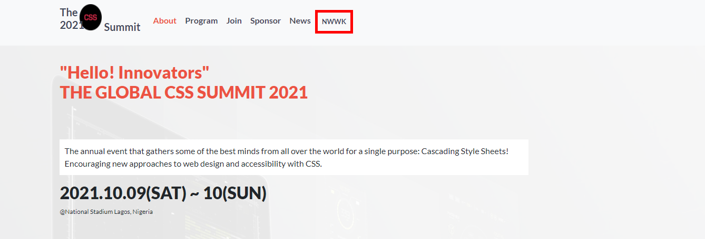

# css-summit

A fictional three days summit on Cascading style sheets (CSS)

## My Portfolio Site

This is a portfolio site inspired by figma

# 
<a href="https://fobadara.github.io/css-summit/" text="bold">Live Demo</a>

# Description

> This is a fictional CSS summit site. It is responsive and follows a design from Behance. I took the oportunity to practice Object Oriented Programming and the MVC design pattern so I apologise for the lengthy code in such a small project.

# Built With :hammer:

● HTML

● CSS

● Javascript

# Technologies Used

● Linters

● Vs Code

● Github

# Getting Started

To get a local copy up and running follow these simple example steps.

⬜ clone the app by running this command `git clone https://github.com/fobadara/css-summit.git`

⬜ Run this command `cd css-summit`

⬜ Open in browser

# Prerequisites

You will be needing:

⬜ A web browser to view output

⬜ A text editor or terminal

# Run tests

You can run tests by following these steps:

⬜ commit and push your changes

⬜ navigate to pull request

⬜ I have created a pull request which runs linters or you could simply create a pull rrequest of your own

# Authors

👤 Abdulfatai Badara

GitHub: github.com/fobadara

Twitter: fob90s@twitter.com

# 🤝 Contributing

Contributions, issues, and feature requests are welcome!

Feel free to check the issues page.

# Show your support

Give a ⭐️ if you like this project!

# Acknowledgments

Hat tip to anyone whose code was used

Lots of appreciations to my wife, Habeebah who keeps supporting me

Lot of appreciation to [Cindy Shin](https://www.behance.net/adagio07) for the design template.

# 📝 License

This project is licensed by [MIT](LICENSE)
